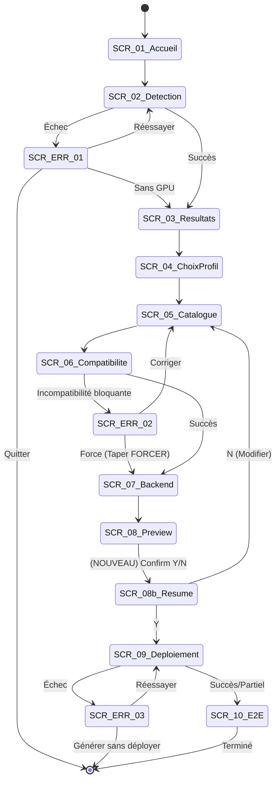
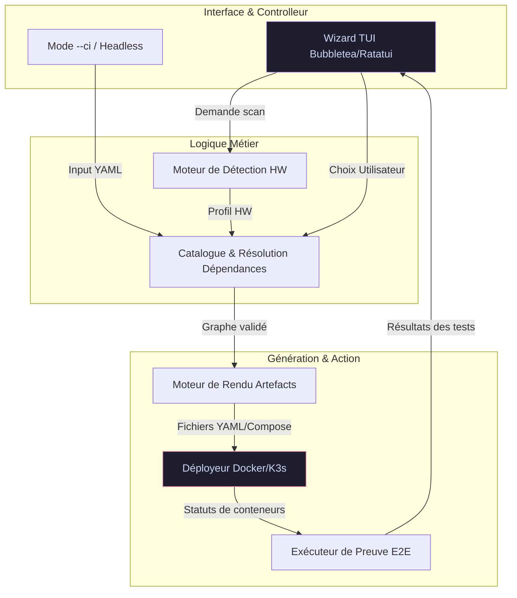

<!-- Livrable Phase A — §1 plan maître
membre: gemini (Gemini-3.1-Pro via forge-model-bridge, provider_id=Gemini-3.1-Pro)
date: 2026-07-14 | statut: DONE | claim: UNVERIFIED (revue aveugle à venir au plan-freeze)
note Fable: le flowchart §4 mentionne "Bubbletea/Ratatui" — incohérence avec la spec (Textual/Python); à corriger au plan-freeze.
-->
### 1. Verdict UX global
Le flux proposé est fonctionnellement complet et ambitieux, mais souffre de failles critiques sur la rétention d'état (raccourci de langue destructeur) et le manque de friction sur les actions risquées ("Forcer"). L'ajout d'une étape de confirmation pré-déploiement, la gestion des petits terminaux et le support de l'automatisation (CI/CD) sont impératifs pour élever ce TUI au rang d'outil robuste de classe entreprise.

### 2. Constats priorisés

*   **{UX-01, Critique, Global}** : Raccourci Ctrl+L qui renvoie au SCR-01. **Problème** : Perte totale de la progression en cours de configuration. **Recommandation** : Implémenter la bascule de langue *in-place* avec rafraîchissement dynamique des labels de l'écran courant.
*   **{UX-02, Critique, SCR-06}** : Bouton « Forcer » trop accessible lors des conflits. **Problème** : Risque de déploiement cassé par un appui rapide sur "Entrée". **Recommandation** : Ajouter une friction intentionnelle (ex: exiger de taper le mot "FORCER" dans un prompt textuel).
*   **{UX-03, Majeure, SCR-08/09}** : Passage direct de la preview au déploiement. **Problème** : Aucune vue consolidée de ce qui va être réellement fait (impact, ports, ressources). **Recommandation** : Ajouter un SCR-08b (Résumé pré-déploiement) exigeant une confirmation explicite (Y/N).
*   **{UX-04, Majeure, Architecture}** : Absence de mode *headless*. **Problème** : Inutilisable en CI/CD ou via script. **Recommandation** : Supporter un flag `--ci` avec un fichier YAML d'entrée qui court-circuite le TUI SCR-01 à SCR-08.
*   **{UX-05, Majeure, SCR-03/SCR-09}** : Gestion ignorée des terminaux étroits (ex: 80x24). **Problème** : Les tableaux larges et les logs splittés vont "baver" et rendre le TUI illisible. **Recommandation** : Détecter la taille (SIGWINCH), basculer en vue liste si largeur < 100 col, et avertir l'utilisateur.
*   **{UX-06, Majeure, SCR-10}** : E2E bloqué si un seul healthcheck échoue. **Problème** : Frustrant si un service mineur (ex: monitoring) échoue mais que le core fonctionne. **Recommandation** : Afficher le SCR-10 même en cas d'échec partiel, en listant clairement ce qui marche et ce qui est cassé.
*   **{UX-07, Mineure, SCR-05}** : Profil Minimal non modifiable. **Problème** : L'utilisateur voulant "Minimal + 1 outil" doit repartir de zéro en "Standard". **Recommandation** : Bloquer la suppression des 3 briques de base, mais permettre l'ajout de briques supplémentaires.
*   **{UX-08, Mineure, Global}** : Fonction "Echap" ambiguë. **Problème** : Quitte-t-elle l'app ou fait-elle "Retour" ? **Recommandation** : Echap = Retour arrière (historique d'écrans), et `Ctrl+C` ou un bouton explicite pour Quitter avec confirmation.
*   **{UX-09, Mineure, SCR-02}** : Détection hardware impossible à relancer manuellement. **Problème** : Si l'utilisateur branche un eGPU ou libère de la RAM, il doit redémarrer l'outil. **Recommandation** : Ajouter un raccourci clavier `Ctrl+R` global pour relancer la détection.

### 3. Diagramme du flux d'écrans corrigé

### 4. Diagramme d'architecture de l'outil

### 5. Principes UX fondateurs (Canon)

1.  **Immutabilité de l'état UI** : Toute action transversale (langue `Ctrl+L`, redimensionnement) doit préserver le contexte et la progression de l'utilisateur (aucune redirection sauvage).
2.  **Friction par conception (Safety First)** : Rendre les actions dangereuses ou contraires aux recommandations (forcer une incompatibilité, écraser une config) asymétriquement plus difficiles à exécuter (saisie manuelle requise).
3.  **Transparence radicale de l'échec** : Ne jamais cacher un échec (même partiel) et ne bloquer l'interface finale (E2E) que si le processus est physiquement interrompu. L'utilisateur doit voir ce qui a échoué.
4.  **Débrayabilité absolue** : Le TUI est une surcouche de confort. Toute action réalisable dans le Wizard doit être scriptable sans interface via un mode *headless* (fichiers de config, flags).
5.  **Élasticité du Terminal** : Le design doit se dégrader gracieusement. Si l'affichage optimal n'est pas possible (80x24), basculer vers des composants minimalistes (listes vs tableaux) plutôt que de tronquer l'information.
